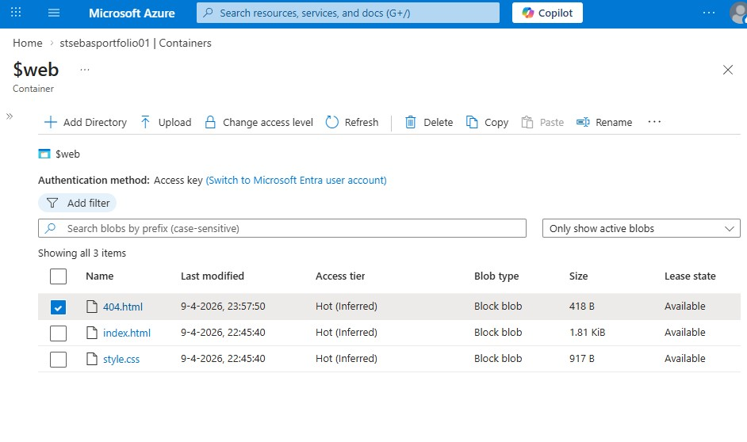

# Azure Static Website – Beginner Project

A simple static website hosted on Microsoft Azure using Azure Blob Storage with Static Website Hosting enabled.

🔗 **Live demo:** [View website](https://stsebasportfolio01.z16.web.core.windows.net/)

---

## 📌 About this project

This is my first hands-on Azure project. I built a simple static website using HTML and CSS and deployed it to Azure using a Storage Account with Static Website Hosting.

The goal was to understand the basics of cloud hosting and get familiar with the Azure portal and core services.

---

## 🎯 Why Azure Blob Storage?

I chose Azure Blob Storage with Static Website Hosting because:
- It is a cost-effective solution for hosting static content (no server required)
- It is easy to set up and manage via the Azure portal
- It integrates well with Azure CDN for future scalability
- It is a good starting point before moving to Azure Static Web Apps

---

## 🛠️ Azure services used

- Azure Resource Group
- Azure Storage Account
- Azure Static Website Hosting ($web container)

---

## 🚀 Deployment steps

1. Created a Resource Group in Azure
2. Created a Storage Account
3. Enabled Static Website Hosting
4. Uploaded HTML and CSS files to the `$web` container
5. Website went live via the Azure endpoint

---

## 📁 Project structure

```text
azure-static-website-beginner/
├── index.html
├── style.css
├── 404.html
├── README.md
└── screenshots/
    ├── resource-group.jpg
    ├── storage-account.jpg
    ├── static-website.jpg
    ├── web-container.jpg
    ├── custom-404-page.jpg
    └── live-website.jpg
```
## Screenshots

### Resource Group


### Storage Account


### Static Website


### $web Container


### Custom 404 page


### Live Website


---

## 💡 What I learned

- How to host a static website on Azure without a server
- How Azure Storage Accounts and containers work
- The importance of documenting steps clearly on GitHub

---

## 🚧 Future improvements

- Connect a custom domain
- Add Azure CDN for better performance
- Migrate to Azure Static Web Apps for CI/CD support

---

## 👨‍💻 About me

I am working towards becoming an Azure specialist and actively building my portfolio.
This project is part of that journey 🚀