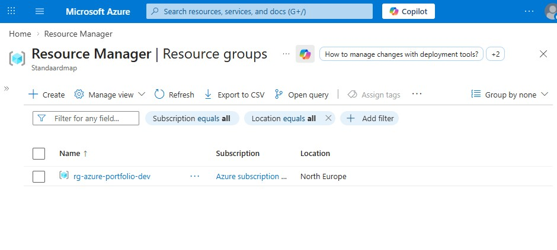
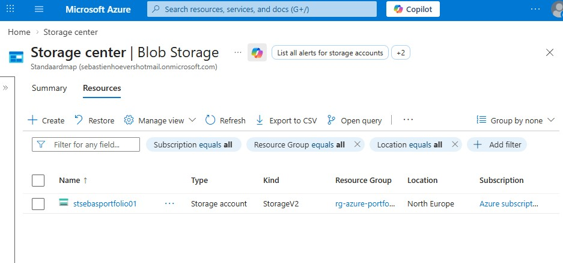
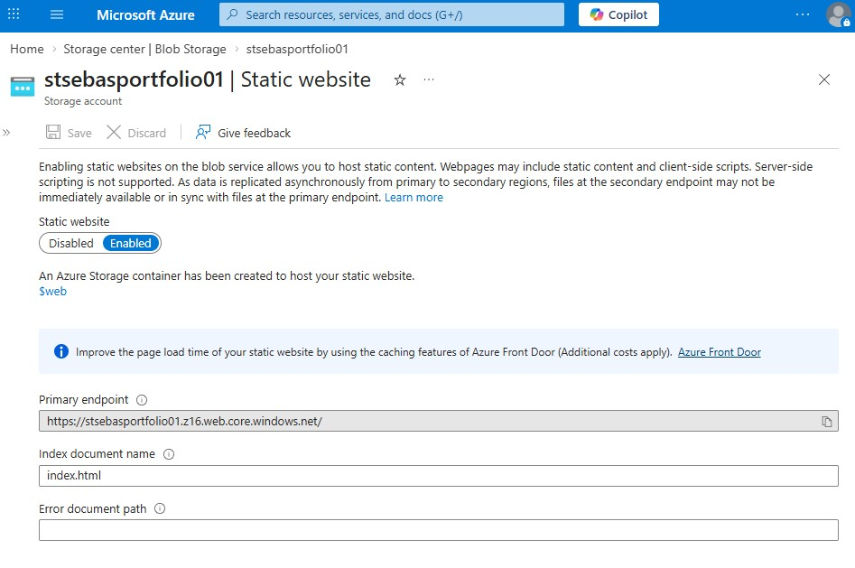
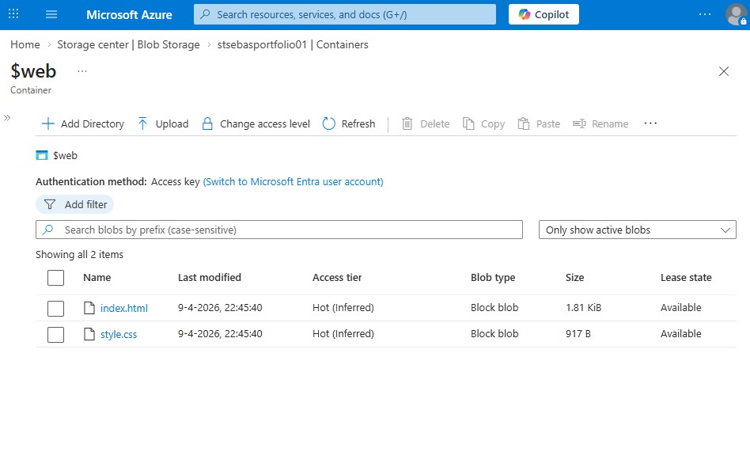
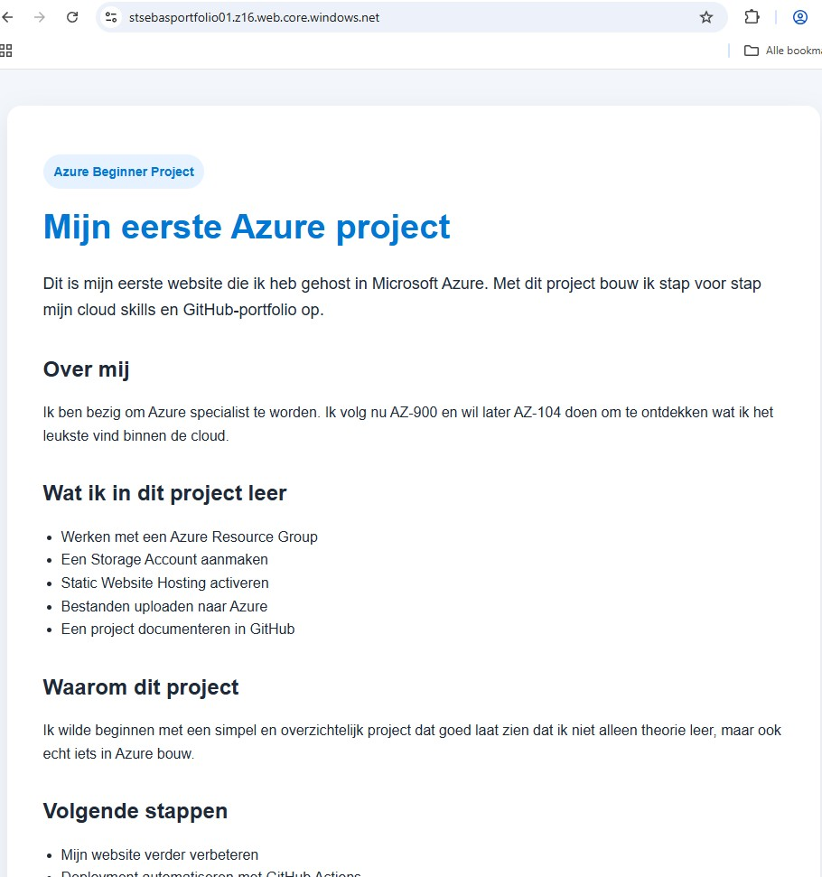

🔗 Live website: [Bekijk mijn website](https://stsebasportfolio01.z16.web.core.windows.net/)

# Mijn eerste Azure project – Static Website in Azure

Dit is mijn eerste Azure project als beginner in cloud en onderdeel van mijn GitHub-portfolio.

## Over dit project

Voor dit project heb ik een simpele statische website gebouwd met HTML en CSS en gehost in Microsoft Azure via een Storage Account met Static Website Hosting.

Dit is mijn eerste hands-on ervaring met Azure.

## Doel van dit project

Ik ben bezig om Azure specialist te worden. Op dit moment studeer ik voor AZ-900 en wil ik daarna AZ-104 doen om te ontdekken wat ik het leukste vind binnen de cloud.

Met dit project wil ik:
- praktijkervaring opdoen in Azure
- begrijpen hoe hosting werkt
- leren werken met GitHub
- een portfolio opbouwen

## Azure services die ik heb gebruikt

- Azure Resource Group
- Azure Storage Account
- Azure Static Website Hosting

## Wat ik heb gedaan

- Resource Group aangemaakt
- Storage Account aangemaakt
- Static Website ingeschakeld
- HTML en CSS bestanden geüpload naar de `$web` container
- Website live gezet via Azure

## Projectstructuur

```text
azure-static-website-beginner/
├── index.html
├── style.css
├── 404.html
├── README.md
└── screenshots/
```
## Screenshots

### Resource Group


### Storage Account


### Static Website


### $web Container


### 404


### Live Website


## Deployment stappen

1. Resource Group aangemaakt in Azure
2. Storage Account aangemaakt
3. Static Website ingeschakeld
4. Bestanden geüpload naar de `$web` container
5. Website live gezet via Azure endpoint

## Kosten

Dit project maakt gebruik van Azure Storage en brengt minimale kosten met zich mee. 
De volledige omgeving kan eenvoudig verwijderd worden door de Resource Group te verwijderen.
